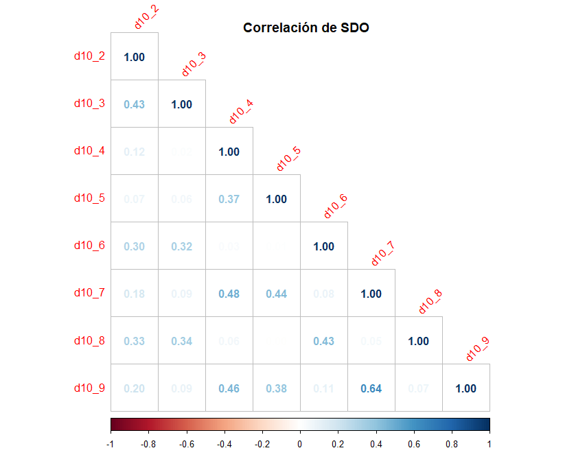
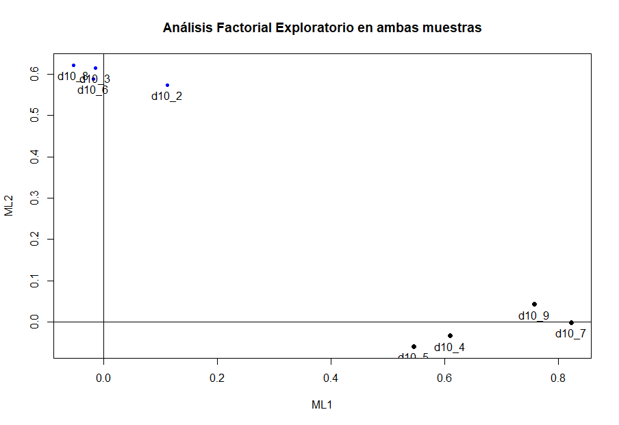
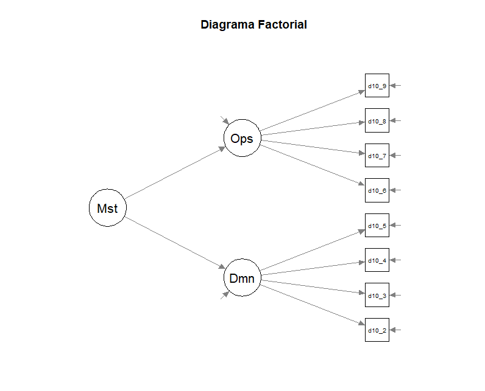
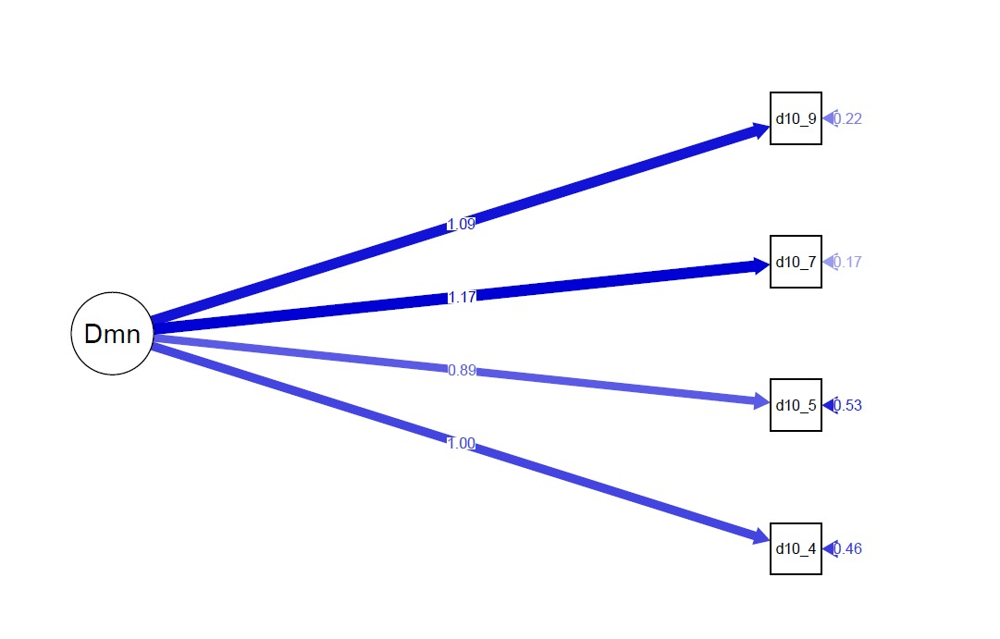

```{r setup, include = FALSE}
# loading libraries
library(tidyverse)
library(palmerpenguins)
library(fontawesome)

# preset code chunk options
knitr::opts_chunk$set(dpi = 300,            # ensures high resolution images
                      echo = FALSE,         # FALSE: code chunks don't show
                      warning = FALSE,      # FALSE: suppresses warning messages
                      error = FALSE)        # FALSE: Suppresses error messages
```

class: title-slide, center, middle, inverse
background-image: url(img/carabineros.png)
background-position: bottom
background-size: cover

# `r rmarkdown::metadata$title`

Matías Deneken & Federico Díaz


---

## Introducción 

Existe una amplia documentación que refiere a la desventajas acumuladas que enfrentan las personas índigenas a lo largo de su vida.  

En Chile, esto ha obtenido mayor relevancia por la subyugación histórica desde los tiempos de la colonia. 

Un aspecto destacado es que en dicho país, de un total de 1.691.692 personas que se autoidentifican como indígenas, un 82% se autoidentifica como Mapuche. Por esta razón, gran parte de los estudios se han centrado en la investigación de este pueblo originario, tanto por su volumen poblacional como por su presencia a lo largo del territorio nacional.

.pull-left[
.left[

**Imagen del Mapuche**

* Guerrero
* Insubordinado

]]

.pull-left[
.left[

**Políticas represivas**

* Operación huracán
* Comando jungla

]]


---

## Introducción 

Una de las teorías que ha explorado la justificación de la desigualdad es la Teoría de la Dominancia Social (Pratto et al., 2006) que sostiene que las sociedades establecen jerarquías sociales entre grupos que poseen mayor poder político y estatus social en comparación con aquellos que tienen menos poder y estatus.

El propósito de esta investigación es replicar parte de un trabajo de [Jost & Thompson (2000)](https://psycnet.apa.org/record/2000-03797-001) en que compara que la dominación basado en grupo y el antiigualitarismo tiene construcciones distintas entre afroamericanos y estadounidenses de origen europeo. **Para nuestro caso, creemos oportuno indagar sobre la relación que existe entre Mapuches y No Mapuches en torno a la dominancia y antiigualitarismo**


Además, desde la teoría de identidad social (Tajfel & Turner, 1986), **se espera que para miembros de bajo estatus (mapuches) exista una relación negativa entre identificación con el propio grupo y la orientación hacia la dominancia social**. Al contrario, para miembros de alto estatus (chilenos) se espera que la relación entre identificación con el propio grupo y dominancia social sea positiva.


---

## Métodos 
#### Datos 

La base de datos utilizada fue Encuesta Longitudinal de Relaciones Culturales (ELRI) aplicada por el Centro de Estudios Interculturales Indígenas (CIIR).

El diseño muestral de ELRI es de tipo probabilístico, estratificado y por conglomerados. La Ola 1 posee un total de 3600 casos, pero al filtrar por el grupo de `Mapuche` y `No Mapuche` nos quedamos con 2572 casos.


#### Variables 

Utilizamos la variable `a1` que tiene como enunciado *¿Se considera perteneciente a alguno de los siguientes Pueblos Originarios?*, en que 1 es Mapuche y 12 ninguno. Por otro lado, utilizamos las variables `a4` y `a6`, teniendo la primera el enunciado de `¿Cuánto se identifica con los (% PUEBLO ORIGINARIO)?` y la segunda `¿Cuánto se identifica con Chile?`. Ambas preguntas poseeen una puntuación que va de (1) Muy poco a (5) Mucho.

Por último utilizamos la escala SDO presente en ELRI. Si bien la escala original contiene 16 ítems que son subdivididos las dimensiones de "Dominación Grupal" y "Oposición a la igualdad" en ELRI el set es tán solo de 8. 

---

## Escala

| Código | Enunciado                                                                                          | Subdimensión                |
|---------------|------------------------------------------|---------------|
| D10_2  | En una sociedad ideal, algunos grupos deben estar arriba y otros grupos deben estar abajo.         | **Dominancia grupal**       |
| D10_3  | Algunos grupos de personas son simplemente inferiores a otros grupos.                              |                             |
| D10_4  | Los grupos que están abajo en la sociedad merecen tener lo mismo que los grupos que están arriba.  |                             |
| D10_5  | Ningún grupo debiera dominar la sociedad                                                           |                             |
| D10_6  | La igualdad entre grupos debiera ser un objetivo de baja prioridad.                                | **Oposición a la igualdad** |
| D10_7  | Debiéramos trabajar para que todos los grupos tengan la misma oportunidad de éxito en la sociedad. |                             |
| D10_8  | Es injusto intentar que haya igualdad entre todos los grupos.                                      |                             |
| D10_9  | Debiéramos hacer todo lo posible por igualar las condiciones de diferentes grupos.                 |                             |

: Preguntas de Escala de Dominación Social (SDO) en ELRI 2016

---

## Métodos 
### Estrategia de análisis 

.pull-left[
.left[

* Para validar la escala de dominación social y describir sus propiedades psicométricas se llevará a cabo un análisis factorial exploratorio y confirmatorio

]]

.pull-right[
.left[

* En cuanto a las hipótesis sustantivas de esta investigación, se realizará un modelo de ecuaciones estructurales MIMIC, en el cual la variable dependiente endógena es la variable latente de orientación hacia la dominación social, la cual es predicha por la variable manifiesta de pertenencia al pueblo mapuche o chileno e identificación por el propio grupo.

]]
---

## Resultados

Al realizar una EFA vemos que no existen correlacions fuertes entre los ítems definidos ni tampoco hay un ajuste de ML esperado. 

.pull-left[
.right[
```{r echo=FALSE, out.height=400, out.width= 500}

```
]]

.pull-left[
.right[

```{r echo=FALSE, out.height=400, out.width= 500}

```

]]

---

## Resultados

.pull-left[
.left[

Definimos el diagrama del Análisis Factorial Confirmatorio a partir de la Oposición a la Igualdad y Dominacia Social. 

Cuando se realiza un ajuste general se aprecia que el valor que el CFI toma es de `0.54`. Esto sugiere que el modelo propuesto no se ajusta de manera óptima a los datos observados. De igual manera, el RMSEA toma un valor de `0.18` y nos sugiere que el modelo no tiene un ajuste suficiente. Por último, el GFI posee un valor de `0.84`, lo que sugiera que podría haber un margen de mejora en el modelo propuesto.

]]


.pull-right[
.left[
```{r, echo=FALSE, out.width="120%", fig.align='center'}

```

]]
---

## Resultados

**Ajuste del CFA**

Se redujo de 8 a 4 reactivos y se consideró un solo ítem. 


```{r, echo=FALSE, out.width="60%", fig.align='center'}

```

** Análisis de invarianza**

Invarianza configural, métrica y escalar. Es decir, la variable latente posee el mismo patrón de cargas. 

---

## Resultados

Los resultados descriptivos nos demuestran que las personas Mapuche poseen menores inclinaciones hacia la dominancia grupal y oposición a la igualdad.


|                             | Mapuche  | No indígena (4) |
|-----------------------------|-------------|----------------|
| **Promedio Dominancia grupal**   | 2.45        | 2.52           |
| **Promedio Oposición a la igualdad** | 2.40        | 2.45           |


**Modelo estadístico: MIMIC**

El modelo de regresión planteado combinó las variables "Orgullo con pueblo originario" con "Orgullo con Chila" con el propósito de ver cómo estas varaibles podrían predecir un mayor o menor puntaje de la SDO.

* El primer modelo muestra que hay una relación significativa entre entre el grupo de pertenencia y la dominancia social, dado que los mapuches tienden a tener menos puntajes. 
* En el segundo modelo, se parecia un relación negativa entre el grado de orgullo y la dominancia social con el grupo mapuche; mientras que para chilenos la relacion es negativa. Sin embargo, para ambos casos la asociación estadística no es significativa.


---

## Conclusión 

La presente investigación poseía dos grandes objetivos: 1) Evaluación psicométrica de la SDO y 2) testear si los miembros de bajo status social tendrían menor puntuación en la escala mencionada.

.pull-left[

**Análisis Factoriales**

* El Alpha de Cronbach arrojó que no existía consistencia interna.
* En Análisis Factorial nos demostró que las dos dimensiones existentes de la SDO no se ajustó los datos .
* El análisis de invarianza demostró que los Chilenos y Mapuches tienen invarianza configural, métrica y escalas. 

]

.pull-right[

**MIMIC**

* Los mapuches tienen menor puntuación en la Escala SDO en comparación con los que no se identifican con ningún pueblo originario.

* El examen de multigrupo no tienen evidencia estadística significativa como para aceptar nuestra hipótesis. 

]

---
## Conclusión 

### Potenciales impactos

* Que el grupo mapuche tenga menor puntaje nos ayuda a comprender los matices de pertenencer a un grupo con menor status sociales. 
  + Lo que es relevante en el marco del conflicto que ha marcado entre la sociedad chilena y los pueblos originarios.
* La escala no tuvo un ajuste esperado entre Mapuches y Chilenos. 
  + Lo que es relevante en tanto que ELRI es una de las pocas encuestas que captura a ambos grupos de formar longitudinal.


###Futuras investigaciones 

* Realizar un análisis longitudinal que identifique como el factor tiempo contribuya a la variación del puntaje. 


---
class: middle, inverse, title-slide

.pull-left[
# Muchas Gracias
<br/>
## Instituto de Sociología

### Modelo de Ecuaciones Estructurales (SOL3067)
]

.pull-right[
.right[


]]


