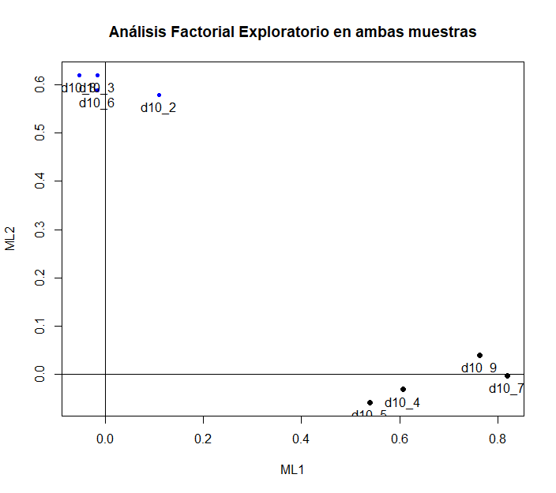
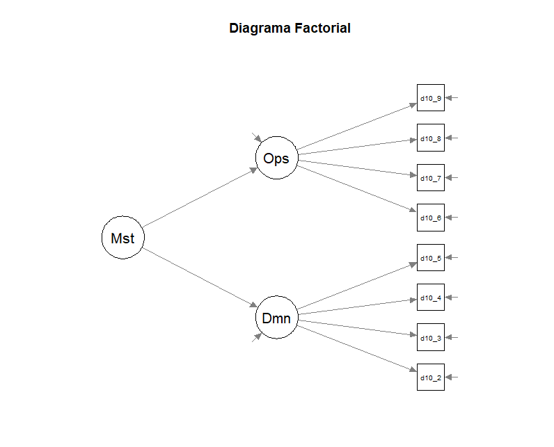

```{r, warning=FALSE, cache=FALSE, message=FALSE, echo=FALSE}
#Paquetes
pacman::p_load(stargazer, # Reporte a latex
sjPlot, sjmisc, # reporte y gráficos
corrplot, # grafico correlaciones
xtable, # Reporte a latex
Hmisc, # varias funciones
psych, # fa y principal factors
psy, # scree plot function
nFactors, # parallel
GPArotation, # rotación
tidyverse,
haven)
```

## Introducción [^1]

[^1]: El presente trabajo puede replicarse en el siguiente enlace de [[GitHub]{.underline}](https://github.com/mdknu/Trabajo-SOL3067)[*.*]{.underline}

Existe una amplia documentación que destaca las múltiples desventajas que enfrentan las personas indígenas a lo largo de sus vidas (United Nations, 2016) Estas desventajas están relacionadas con la desigualdad en el acceso a mejores niveles socioeconómicos, educación superior y una menor esperanza de vida, por nombrar algunos ejemplos. Además, existe un consenso relativo que e este grupo de población se encuentra en mayor medida excluido de las decisiones políticas en sus respectivos países (Lamb & Verma, 2021; Schuch et al., 2017; Sue & Riosmena, 2021) . Como resultado, se han propuesto medidas para mitigar la desigualdad y discriminación a las que se enfrentan (Ramírez, 2021).

En el caso de Chile, esta problemática ha adquirido mayor relevancia en el úlitmo tiempo y las investigaciones se han tendido a centrar en cómo los pueblos originarios han sido subyugados desde la época colonial hasta la actualidad (A. Cerda, 2009; Fuentes & De Cea, 2017). Esto ha llevado a mayores niveles de pobreza y un reconocimiento político-institucional insuficiente de sus costumbres. Un aspecto destacado en Chile es que, de un total de 1.691.692 personas que se autoidentifican como indígenas, un 82% se autoidentifica como Mapuche. Por esta razón, gran parte de los estudios se han centrado en la investigación de este pueblo originario, tanto por su volumen poblacional como por su presencia a lo largo del territorio nacional.

Algunos estudios han caracterizado al pueblo Mapuche como "guerrero" o "insubordinado", basándose tanto en sus propias historias desde la época de la Conquista (Oteíza & Franzani, 2023), como en el reciente interés que ha surgido en torno a este grupo debido a políticas estatales en Chile que han tendido a criminalizar y estigmatizar a su población (Bonvin & Romo, 2019; Riobó Rodríguez, 2023). Esto se conoce coloquialmente como el "Conflicto Mapuche". Sin embargo, no se han realizado investigaciones que profundicen en la persistencia de esta desigualdad.

Una de las teorías que ha explorado la justificación de la desigualdad es la Teoría de la Dominancia Social (Pratto et al., 2006)  que sostiene que las sociedades establecen jerarquías sociales entre grupos que poseen mayor poder político y estatus social en comparación con aquellos que tienen menos poder y estatus. Parte de la literatura en este tema sugiere que las sociedades intentan mitigar el conflicto mediante ideologías que justifican la superioridad de un grupo sobre otro . Esta teoría se ha operacionalizado a través de la Escala de Dominancia Social, (Ho et al., 2015; Pratto et al., 1994) que tiene dos dimensiones: la Dominancia Grupal, que se refiere a la preferencia por sistemas de dominación, y la Oposición a la Igualdad, que se refiere a la preferencia por sistemas de desigualdad basados en jerarquías grupales. El uso de esta escala ha demostrado que la dominancia social se correlaciona positivamente con índices de racismo y nacionalismo y negativamente con actitudes relacionadas con el igualitarismo y el universalismo (Harnish et al., 2018).

La teoría de la identidad social (Tajfel y Turner, 1986) asume que las actitudes son moldeadas por la pertenencia de los individuos a grupos sociales y el contexto estructural en el que se encuentran esos grupos. Cuando las personas piensan en sí mismas en términos de su pertenencia a un grupo social, se sienten motivadas a proteger la identidad de ese grupo en relación con otros grupos, especialmente cuando los límites de estatus entre los grupos son rígidos y las diferencias de estatus entre los grupos son cuestionables (Tajfel, 1978a).

El propósito de esta investigación es replicar parte de un trabajo de Jost & Thompson (2000) en que compara que la dominación basado en grupo y el antiigualitarismo tiene construcciones distintas entre afroamericanos y estadounidenses de origen europeo. Para nuestro caso, creemos oportuno indagar sobre la relación que existe entre Mapuches y No Mapuches. Basándonos en las concepciones del mencionado artículo, será lógico que -en general- las personas autoidentificadas como Mapuches apoyen más la igualdad que los no mapuches. De igual manera, hace sentido que los mapuches sean menos susceptibles de la dominación de grupo que los no-mapuches, en el sentido que los primeros han sido víctimas estructurales de dominación, mientras que el segundo se ha beneficiado de ella. Teniendo esto en consideración, creemos que los mapuches tiendan a apuntar menos alto en la escala en comparación con los no mapuches.

Además, desde la teoría de identidad social (Tajfel & Turner, 1986), se espera que para miembros de bajo estatus (mapuches) exista una relación negativa entre identificación con el propio grupo y la orientación hacia la dominancia social. Al contrario, para miembros de alto estatus (chilenos) se espera que la relación entre identificación con el propio grupo y dominancia social sea positiva.


## Metodología

### Datos

La base de datos utilizada fue Encuesta Longitudinal de Relaciones Culturales (ELRI) aplicada por el Centro de Estudios Interculturales Indígenas (CIIR). Esta encuesta posee 4 olas con una aplicación periódica de 18 meses y con una muestra espejo que se divide en dos categorías: (1) Pueblo Andino/No Pueblo Andino y (2) Mapuche/No Mapuche, criterio muestral basado en la localidad geográfica y en la autoidentificación indígena de los encuestados.

El diseño muestral de ELRI es de tipo probabilístico, estratificado y por conglomerados. La Ola 1 posee un total de 3600 casos, pero al filtrar por el grupo de Mapuche y No Mapuche nos quedamos con 2300 casos. La elección muestral del grupo se debe a que, de momento, consideramos relevante prestar atención en las diferencias que puedan tener ambas categorías, dada la potencial riqueza que puede conllevar la utilización de pueblo mapuche como referencia investigativa (tanto por su amplia atención científica y por su alta presencia a lo largo del territorio chileno). De igual manera, nos quedamos con la Ola 1 porque ahí es donde más casos existen.

### *Variables*

Para nuestra investigación utilizaremos la SDO presente en ELRI. Si bien la escala original contiene 16 ítems que son subdivididos las dimensiones de "Dominación Grupal" y "Oposición a la igualdad", ELRI solo se contiene 8 ítems que se encuentran equitativamente distribuidos. De igual manera, la escala original tenía 11 puntos en la escala que iban de "(0) Completamente en desacuerdo" a "(10) completamente de acuerdo", en ELRI la escala toma valores de 1 a 5, dónde 1 es "Muy en desacuerdo" y 5 "Muy de acuerdo".

En la siguiente `Tabla 1` se muestran los ítems con sus respectivas variables.

| Código | Enunciado                                                                                          | Subdimensión                |
|-------------|----------------------------------------------|-------------|
| D10_2  | En una sociedad ideal, algunos grupos deben estar arriba y otros grupos deben estar abajo.         | **Dominancia grupal**       |
| D10_3  | Algunos grupos de personas son simplemente inferiores a otros grupos.                              |                             |
| D10_4  | Los grupos que están abajo en la sociedad merecen tener lo mismo que los grupos que están arriba.  |                             |
| D10_5  | Ningún grupo debiera dominar la sociedad                                                           |                             |
| D10_6  | La igualdad entre grupos debiera ser un objetivo de baja prioridad.                                | **Oposición a la igualdad** |
| D10_7  | Debiéramos trabajar para que todos los grupos tengan la misma oportunidad de éxito en la sociedad. |                             |
| D10_8  | Es injusto intentar que haya igualdad entre todos los grupos.                                      |                             |
| D10_9  | Debiéramos hacer todo lo posible por igualar las condiciones de diferentes grupos.                 |                             |

: Preguntas de Escala de Dominación Social (SDO) en ELRI 2016

Dado que la variable d10_4, d10_5, d10_7 y d10_9 tenían redactas las preguntas de formas inversa a las originales, se debió ajustar restar la respuesta obtenida por un 5. Con ello se logro tener el ítem con la misma dirección a las otras variables. 

### *Análisis *

Para validar la escala de dominación social y describir sus propiedades psicométricas se llevará a cabo un análisis factorial exploratorio y confirmatorio. Una vez ajustada la escala, se realizará un test de invarianza para comprobar que el instrumento de medición funcione de igual manera para chilenos y mapuches.

En cuanto a las hipótesis sustantivas de esta investigación, se realizará un modelo de ecuaciones estructurales MIMIC, en el cual la variable dependiente endógena es la variable latente de orientación hacia la dominación social, la cual es predicha por la variable manifiesta de pertenencia al pueblo mapuche o chileno e identificación por el propio grupo. Además, para poner a prueba la hipótesis de interacción entre identificación por el propio grupo y grupo de pertenencia, se realizará un análisis multigrupo para chilenos y mapuches.


```{r, echo=FALSE, results='hide'}

#Cargamo base de datos y filtramos por año (2018, Ola 2) y por muestra (M = 3 (Mapuche) y M = 4 (No Mapuche)) 

elri <- read_dta("bbdd/BBDD ELRI HOMOLOGADA 3.0 LONG INNOMINADA.dta") %>% 
  filter(ano == 2016,
      m >= 3) %>%
  dplyr::select(starts_with(c("m","d10")) )%>% dplyr::mutate_at(c('d10_2', 'd10_3',
                                                                      'd10_4', 'd10_5',
                                                                      'd10_6','d10_7',
                                                                      'd10_8','d10_9'), as.numeric)


## Eliminamos datos perdidos. 

elri[elri== 9999 | elri== 8888] <- NA #recodificar No sabe y No responde en NA
sum(is.na(elri)) #indica cantidad de NA

# Volteamos los items

elri$d10_4 <- 6 - elri$d10_4
elri$d10_5 <- 6 - elri$d10_5
elri$d10_7 <- 6 - elri$d10_7
elri$d10_9 <- 6 - elri$d10_9


# Seleccionamos solo la escala de ELRI para evitar confusiones

## Crear BBDD

elri_escala <- elri %>%
  dplyr::select(starts_with(c("m","d10"))) %>% dplyr::select(!c(d10_1))%>%  dplyr::select(3:11)  %>% drop_na()


elri_escala_mapuche <- elri %>% filter(m == 3) %>% 
  dplyr::select(starts_with(c("m","d10"))) %>% dplyr::select(!c(d10_1))%>%  dplyr::select(3:11)  %>% drop_na()


elri_escala_nomapuche <- elri %>% filter(m == 4) %>% 
  dplyr:: select(starts_with(c("m","d10"))) %>% dplyr::select(!c(d10_1))%>%  dplyr::select(3:11)  %>% drop_na()

data <- elri_escala
data_mapuche <- elri_escala_mapuche
data_nomapuche <- elri_escala_nomapuche

data$m <- NULL
data_mapuche$m <- NULL #Eliminamos muestra
data_nomapuche$m <- NULL #Eliminamos muestra

```

## Resultados

Los resultados seran divididos en dos apartados: Un análisis descriptivo, Un análisis factorial exploratorio (AFE) y Análisis Factorial Confiromatorio (CFA). Esto con el propósito de ver , por un lado, el ajuste no hipotetizado de la escala y, por otro, identificar si la SDO se ajusta en esta encuesta.

```{r, echo=FALSE}
estadistico <- elri %>% group_by(m) %>% dplyr::select(!c(d10_1)) %>% 
  summarise(across(starts_with("d"), list(media = ~mean(.x, na.rm = TRUE), sd= ~sd(.x, na.rm = TRUE)))) 
```

## Descriptivos

Los análisis descriptivos nos demuestran una homogénea respuesta entre Mapuches y No Mapuches, tanto en su media como en las desviaciones estándar. Esto además se comprueba en que los promedios totales son similiares para las dos variables en ambos grupos. La dimensión *dominancia grupal* obtuvo 2.45 para los Mapuches y 2.52 para los No Mapuches; mientras que *oposición a la desigualdad* fue de 2.40 y 2.45, respectivamente. Si bien las diferencias son pequeñas, el grupo No Mapuche tiende a puntear más alto en ambas dimensiones.

|                             | Mapuche (3) | No Mapuche (4) |
|-----------------------------|-------------|----------------|
| **Dominancia Grupal**       |             |                |
| Media d10_2                 | 2.59        | 2.63           |
| Desviacion Stándar d10_2    | 0.94        | 0.94           |
| Media d10_3                 | 2.73        | 2.74           |
| Desviacion Stándar d10_3    | 1.03        | 1.03           |
| Media d10_4                 | 2.23        | 2.36           |
| Desviacion Stándar d10_4    | 0.83        | 0.86           |
| Media d10_5                 | 2.23        | 2.32           |
| Desviacion Stándar d10_5    | 0.85        | 0.85           |
| *Promedio total*            | 2.45        | 2.52           |
| **Oposición a la igualdad** |             |                |
| Media d10_6                 | 2.79        | 2.77           |
| Desviacion Stándar d10_6    | 1.04        | 1.01           |
| Media d10_7                 | 1.99        | 2.11           |
| Desviacion Stándar d10_7    | 0.70        | 0.76           |
| Media d10_8                 | 3.23        | 3.21           |
| Desviacion Stándar d10_8    | 1.02        | 0.99           |
| Media d10_9                 | 2.03        | 2.12           |
| Desviacion Stándar d10_9    | 0.71        | 0.76           |
| *Promedio total*            | 2.40        | 2.45           |

: Descriptivos de SDO por muestra

```{r, echo=FALSE, warning=FALSE, message=FALSE}
pacman::p_load(lavaan,
ltm, # para Cronbach's alpha
corrplot, #  grafico correlaciones
psych, # fa factor analysis
xtable, # tablas a latex
semPlot # diagramas SEM
)
```

```{r, eval=FALSE, echo=FALSE}
corMat  <- cor(data)  # estimar matriz pearson
options(digits=2)
corMat # muestra matriz

corMat  <- cor(data_mapuche)  # estimar matriz pearson
options(digits=2)
corMat # muestra matriz

corMat  <- cor(data_nomapuche)  # estimar matriz pearson
options(digits=2)
corMat # muestra matriz

```

Al verificar las correlaciones entre los ítems se aprecia que en ambos grupos las correlaciones son positivas, lo que es coherente dado por la configuración de la Escala. Sin embargo, no existen correlaciones sustantivamente altas. Para el grupo autoidentificado como Mapuche las correlaciones más alta se encuentran en la variable `d10_2` con la `d10_3` (0.43), la `d10_4` con la `d10_9` (0.45) , la `d10_4` con la `d10_7` (0.47) y la `d10_7` con la `d10_9` (0.63). Mientras que para el grupo autoidentificado como no mapuche, las correlaciones más alta se encuentran en la variable `d10_2` con la `d10_3` (0.45), la `d10_4` con la `d10_7` (0.48) y la `d10_7` con la `d10_9` (0.64). Es decir, las correlaciones más altas son similiares en ambos grupos; aunque ninguna supera el umbral de 0.75 que refiere a una "correlación fuerte"

```{r, echo=FALSE, ,out.width="60%", out.height="85%",fig.show='hold',fig.align='center'}
knitr::include_graphics(c("images/correlationsdo_mapuche.png","images/correlationsdo_nomapuche.png"))

```

Al analizar el Alpha de Cronbach para los dos ítemes se aprecia que, para la encuesta en general, el ítem de dominación social tiene un alpha de 0.46, mientras que el oposición a la desigualdad es de 0.52. Cuando comparamos por las muestras, podemos apreciar que las personas que se autoidentifican con el Pueblo Mapuche poseen un alpha de 0.43 y de 0.52; mientras que los No - Mapuche poseen un valor de 0.49 y de 0.52, respectivamente. Es decir, ni a nivel muestral ni a nivel general nuestro $Alpha$ supera el umbral de 0.70 de consistencia. Por este motivo, será necesario realizar un análisis factorial de los ítems que nos permita observar cómo se encuentran agrupada las dimensiones latentes.

```{r, echo=FALSE, results='hide', eval=FALSE, message=FALSE, cache=TRUE}
## Total

ind1=data[, c(1, 2, 3,4)] # seleccionar columnas correspondientes
summary(ind1)
ind2=data[, c(5,6,7,8)] # seleccionar columnas correspondientes
summary(ind2)
cronbach.alpha(ind1[, c(1, 2, 3, 4)]) # ltm package
cronbach.alpha(ind2[, c(1, 2, 3, 4)]) # ltm package

## Mapuche

ind1=data_mapuche[, c(1, 2, 3,4)] # seleccionar columnas correspondientes
summary(ind1)
ind2=data_mapuche[, c(5,6,7,8)] # seleccionar columnas correspondientes
summary(ind2)
cronbach.alpha(ind1[, c(1, 2, 3, 4)]) # ltm package
cronbach.alpha(ind2[, c(1, 2, 3, 4)]) # ltm package

# No Mapuche
ind1=data_nomapuche[, c(1, 2, 3,4)] # seleccionar columnas correspondientes
summary(ind1)
ind2=data_nomapuche[, c(5,6,7,8)] # seleccionar columnas correspondientes
summary(ind2)
cronbach.alpha(ind1[, c(1, 2, 3, 4)]) # ltm package
cronbach.alpha(ind2[, c(1, 2, 3, 4)]) # ltm package

#scree.plot(data)   
#fa.parallel(corElri, n.obs=300)  
```

## Análisis Factorial Exploratorio

Atendiendo la baja puntuación obtenida en el Alpha de Cronbach, buscamos indagar sobre las características que tiene la SDO en la población total y en las muestras de Mapuches y No Mapuches. La tecnica de Análisis Factorial Exploratorio es idónea para este caso, pues nos permite analizar la dimensionalidad de los indicadores considerando el error de medición. Es necesario recordar que las variables deberían encontrarse agrupadas de acuerdo a lo señalado en la Tabla 1, aunque, a la luz de las correlaciones expuestas, creemos que está escala no tendrá una replicación igual en la muestra total (considerando a Mapuches y a No Mapuches). 

```{r, eval= FALSE, message=FALSE, results='hide', cache=FALSE, echo=FALSE}
## Análisis factorial
library(nFactors)
ev <- eigen(corMat) # get eigenvalues
ap <- parallel(subject=300,var=8,
  rep=100,cent=.05)
nS <- nScree(x=ev$values, aparallel=ap$eigen$qevpea)
plotnScree(nS)
library(nFactors)
### Ejes principales
fac_pa <- fa(r = data, nfactors = 2, fm= "pa"); fac_pa
#summary(fac_pa)
### Maximun likelihood
fac_ml <- fa(r = data, nfactors = 2, fm= "ml"); fac_ml
#factor.plot(fac_ml, labels=rownames(fac_ml$loadings), title = "Análisis Factorial Exploratorio en ambas muestras")

pob_1 <- fa(r = data, nfactors = 2, fm= "ml", rotate="promax", scores="regression")
pob_2 <- fa(r = data_mapuche, nfactors = 2, fm= "ml", rotate="promax", scores="regression")
pob_3 <- fa(r = data_nomapuche, nfactors = 2, fm= "ml", rotate="promax", scores="regression")

pob_1

data <- cbind(data, pob_1$scores)

pob_1 <- fa(r = elri_escala, nfactors = 2, fm= "ml", rotate="promax", scores="regression") 
#data <- cbind(elri_escala, pob_1$scores)

```

Así, es que al verificar las cargas factoriales mediante un Maximum Likelihood (ML), vemos que los ítems no se agrupan de acuerdo a la SDO propuesta .En el gráfico `Análisis Factorial Exploratorio en Ambas Muestras`, se aprecia que las variables `d10_2`, ``d10_3`,`d10_6` y `d10_8` se encuentran en reunidas en la esquina superior izquierda mientras que las otras variables en la esquina inferior derecha. Es decir, existen dos factores pero no idénticos a los a priori identificados. En la siguiente `Tabla 3`, se encuentran los valores del ML.

|                  | ML1   | ML2  |
|------------------|-------|------|
| **Mustra total** |       |      |
| Media d10_2      | 0.11  | 0.58 |
| Media d10_3      | -0.02 | 0.62 |
| Media d10_4      | 0.60  | 0.02 |
| Media d10_5      | 0.54  | 0.04 |
| Media d10_6      | 0.02  | 0.59 |
| Media d10_7      | 0.82  | 0.02 |
| Media d10_8      | 0.06  | 0.62 |
| Media d10_9      | 0.76  | 0.06 |

: Maximum likelihood para cargas factoriales

```{r, echo=FALSE, ,out.width="65%", out.height="85%",fig.show='hold',fig.align='center'}

```


## Análisis Factorial Confirmatorio


El análisis factorial confirmatorio (AFC) es una herramienta estadística ampliamente empleada en la investigación social y psicológica para evaluar la validez de una estructura de medición hipotética o un modelo de relaciones entre variables. A diferencia del análisis factorial exploratorio, cuyo objetivo principal es descubrir la estructura subyacente de un conjunto de variables sin imponer restricciones teóricas, el AFC se utiliza específicamente para confirmar o refutar un modelo teórico predefinido.

Como vimos, la escala SDO se emplea como un instrumento para evaluar la inclinación de un individuo hacia la aceptación y el respaldo de jerarquías sociales y desigualdades en la sociedad. A través del AFC, es posible determinar si los elementos de la escala SDO se agrupan de manera apropiada dentro de las dimensiones teóricas propuestas, tales como la creencia en la legitimidad de la desigualdad social y la preferencia por la dominación de ciertos grupos sobre otros. Definimos el análisis factorial de la SDO a partir de las dimensiones propuestas por Pratto et al (1994) y que fueron señaladas al inicio del documento. [^2]

[^2]: Añadimos la variable Muestra (Mapuche y No - Mapuche) a los dos factores [*.*]{.underline}

```{r, eval=FALSE}
cfa_1 <- '
# latent variables
Dominacion=~ d10_2 + d10_3 + d10_4 + d10_5
Oposicion =~ d10_6 + d10_7 + d10_8 + d10_9
'

```

```{r, warning=FALSE, message=FALSE, eval=TRUE, echo=FALSE, results='hide'}

cfa_1 <- '
# latent variables
Dominacion=~ d10_2 + d10_3 + d10_4 + d10_5
Oposicion =~ d10_6 + d10_7 + d10_8 + d10_9
'

fit_1 <- cfa(cfa_1,data=data)


#semPaths(fit_1, 
        # "std",
         #"est", 
#        title = TRUE, fixedStyle = c(1, 1), 
#         curvePivot = FALSE,style = "lisrel",
#         theme = "colorblind",
#         rotation = 2,
#         legend.cex = .5,
 #        layout = "tree2")


#title("Ítems")
#summary(fit_1)
#show(fit_1)
#fitmeasures(fit_1)

```

```{r, echo=FALSE, ,out.width="65%", out.height="85%",fig.show='hold',fig.align='center'}

```


Cuando se realiza un ajuste general se aprecia que el valor que el CFI toma es de `0.64`, lo que es inferior al aceptado de 0.95 Esto sugiere que el modelo propuesto no se ajusta de manera óptima a los datos observados. De igual manera, el RMSEA toma un valor de `0.18`, el que es superior a un 0.05, y nos sugiere que el modelo no tiene un ajuste suficiente. Por último, el GFI posee un valor de `0.83`, lo que sugiera que podría haber un margen de mejora en el modelo propuesto. 

```{r, echo=FALSE}
fitMeasures(fit_1, c("cfi", "rmsea", "gfi"))
```


```{r, echo=FALSE, results='hide', message=FALSE}

covpov=cov(data) # S, matriz de covarianzas de la muestra, -7 para sacar sexo
lowerMat(covpov, digits=3)

residuals(fit_1, type="raw") 
residuals(fit_1, type = "standardized")

```

Al momento de realizar un análisis de los residuos, que refiere a la multiplicación de sus cargas factoriales por la varianza del factor, observamos que existen varios significativos (sobre 1.96). En este sentido, es que al filtrar por el valor crítico de `3.84` del $X^2$, existen 23 covarianzas (de 36 posibles) que están por sobre el valor esperado. A partir de eso, requerimos modificar el ajuste (cuestión que quedará pendiente)

```{r, echo=FALSE, eval=FALSE}
residuals(fit_1, type = "standardized")

```

```{r, echo=FALSE}
mod=modificationindices(fit_1)
x <- subset(mod, mi>3.84, select=lhs:mi)
head(x)
```


\newpage

## Conclusión


El análisis factorial confirmatorio nos muestra que la teoría que postula dos dimensiones para la orientación hacia la dominancia social no se ajusta a los datos. Los indicadores de ajuste del modelo no son aceptables por lo que se requiere en la próxima entrega hacer modificaciones a la especificación del modelo tales como modificación ítems o dejar solo un factor latente. Una vez hecho este ajuste a la especificación, el cual debe ser justificado teórica y empíricamente, se proseguirá a probar invarianza entre mapuches y chilenos para de esta forma, probar las hipótesis sustantivas de la investigación a través de un modelo MIMIC.

De igual manera, queda pendiente realizar el test de invarianza y clarificar las dudas cómo seguir con el mejoramiento de la escala cuando 23 de las covarianzas están por sobre los valores esperados. Este caso requiere una desafío de identificar cuáles son los ítems que mejor se ajustaron a la SDO por lo que, retomando con lo mencionado en el primer párrafo, se evaluará la posibilidad de dejar solo un factor latente. 

Consideramos que estos desafíos metodológicos podrán ser provechosos y podrán ser debidamente anticipados. Creemos provechosos porque, a priori, nos enfrentamos a valores anómalos de funcionamiento y debidamente anticipados porque todavía existe tiempo para ampliar la revisión de literatura. En última instancia, podrán quedar para tareas pendientes cara a que tenemos la intención de poder seguir mejorándole para una potencial publicación académica. 

\newpage

## Bibliografía

A. Cerda, R. (2009). Situación socioeconómica reciente de los mapuches en la Región de la Araucanía. Estudios Públicos, 113. https://doi.org/10.38178/cep.vi113.445

Bonvin, P. V., & Romo, V. O. (2019). When the state is the hacker: A study case of Operación Huracán. Revista Chilena de Derecho y Tecnologia, 8(2). https://doi.org/10.5354/0719-2584.2019.54436

Fuentes, C., & De Cea, M. (2017). Reconocimiento débil: Derechos de pueblos indígenas en Chile. In Perfiles Latinoamericanos (Vol. 25, Issue 49). https://doi.org/10.18504/pl2549-003-2017

Harnish, R. J., Bridges, K. R., & Gump, J. T. (2018). Predicting Economic, Social, and Foreign Policy Conservatism: the Role of Right-Wing Authoritarianism, Social Dominance Orientation, Moral Foundations Orientation, and Religious Fundamentalism. Current Psychology, 37(3). https://doi.org/10.1007/s12144-016-9552-x

Ho, A. K., Sidanius, J., Kteily, N., Sheehy-Skeffington, J., Pratto, F., Henkel, K. E., Foels, R., & Stewart, A. L. (2015). The Nature of Social Dominance Orientation: Theorizing and Measuring Preferences for Intergroup Inequality Using the New SDO7 Scale. Journal of Personality and Social Psychology, 109(6). https://doi.org/10.1037/pspi0000033

Jost, J. T., & Thompson, E. P. (2000). Group-based dominance and opposition to equality as independent predictors of self-esteem, ethnocentrism, and social policy attitudes among african americans and european americans. Journal of Experimental Social Psychology, 36(3). https://doi.org/10.1006/jesp.1999.1403

Lamb, D., & Verma, A. (2021). Nonstandard Employment and Indigenous Earnings Inequality in Canada. Journal of Industrial Relations, 63(5). https://doi.org/10.1177/00221856211021128

Oteíza, T., & Franzani, P. (2023). Valoración del pueblo mapuche desde la evidencialidad histórica: un análisis crí¬tico y multimodal del discurso. Literatura y Lingüística, 46. https://doi.org/10.29344/0717621x.46.3082
Pratto, F., Sidanius, J., & Levin, S. (2006). Social dominance theory and the dynamics of intergroup relations: Taking stock and looking forward. European Review of Social Psychology, 17(1). https://doi.org/10.1080/10463280601055772

Pratto, F., Sidanius, J., Stallworth, L. M., & Malle, B. F. (1994). Social Dominance Orientation: A Personality Variable Predicting Social and Political Attitudes. Journal of Personality and Social Psychology, 67(4). https://doi.org/10.1037/0022-3514.67.4.741

Ramírez, G. (2021). Who Am I and What Is My Role in Reconciliation with Indigenous Peoples? Journal of Intercultural Studies, 42(3). https://doi.org/10.1080/07256868.2021.1935617

Riobó Rodríguez, J. C. (2023). El conflicto chileno-mapuche en clave transnacional: el caso del Comando Jungla chileno y sus vínculos con la doctrina de securitización colombiana. Razón Crítica, 14. https://doi.org/10.21789/25007807.1909

Schuch, H. S., Haag, D. G., Kapellas, K., Arantes, R., Peres, M. A., Thomson, W. M., & Jamieson, L. M. (2017). The magnitude of Indigenous and non-Indigenous oral health inequalities in Brazil, New Zealand and Australia. Community Dentistry and Oral Epidemiology, 45(5). https://doi.org/10.1111/cdoe.12307

Sue, C. A., & Riosmena, F. (2021). Black and Indigenous Inequality in Mexico: Implications for Multiracialism and Intersectionality Research. Sociology of Race and Ethnicity, 7(4). https://doi.org/10.1177/23326492211012028

United Nations. (2016). State of the World’s Indigenous Peoples: Indigenous Peoples’ Access to Health Services. United Nations Department of Economic and Social Affairs.
